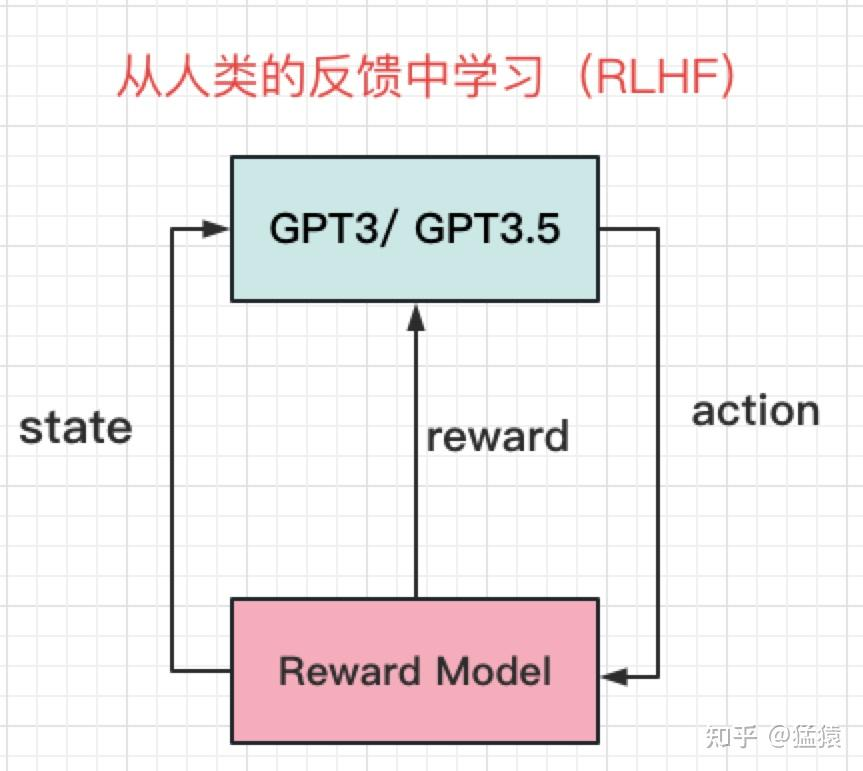

lc：33、153

昨天粗放地把RAG项目过完了，感觉离能写到简历上还差一点距离，不过过几天再复习了，今天继续读猛猿的博客，初七回去初八就可以开始修改一份新简历来投中小厂的实习了。

# GPT系列

## 训练框架InstructGPT
教会模型怎么说话（pretrain）
引导模型按照人类的意图（intention）说话
给模型的回答进行排序/打分
将打分结果反馈给模型，帮助模型更好总结人类意图

**GPT3** 2020年 175B
**GPT3.5**与GPT3原理基本一致，在训练数据上，引入codex数据集在GPT3上做微调，所以在chatGPT中，也能发现其具备对代码的解析能力。
**GPT-SFT**，解决了GPT3.5 **只是按照所学回答问题，而在贴合人类意图上还有所欠缺，也就是，还不够"类人"** 的问题。直接了当的告诉它，人类想要什么回答

prompt包含如下类型：
- **Plain**：让标注人员不受约束，随意写一些问题
- **Few-shot**: 让标注人员按照Instruction: (prompt, completion)的方式进行标注。例如：请做翻译: (苹果->Apple)
- **User-based**： 让标注人员从openAI API的请求列表用例中，找一些问题进行标注。例如Generation类-请对下文做总结，Branstorming类-请列出保持职业热情的5种方法等。

在论文中，一组(prompt, completion)也被称为demonstration。

### 奖励模型（RM, Reward Model）

GPT大概能朝着人类意图的方向走时，我们需要给他更量化的指标
训练一个**奖励模型（RM，Reward Model）**。

要对同一prompt的不同回答进行排序，一共有33k的标注数据被用于训练。

从 Pairwise Ranking Loss 入手，来更好理解上面过程：
$$loss(\theta)=-\frac{1}{C_{K}^{2}}E_{(x,y_{w},y_{l})\sim D}[log(\sigma(r_{\theta}(x,y_{w})-r_{\theta}(x,y_{l})))]$$

其中

- $x$表示某个prompt

- $y_w$和$y_l$分别表示该 prompt 下的任意一对回答，并且假设标注中$y_{w}$的排序是高于$y_l$的

- $D$表示prompt 下人类标注排序的所有两两回答对

- $r_{\theta }$表示奖励模型

- $\sigma$表示sigmoid函数

### 基于人类反馈的强化学习（RLHF）

模型学会了怎么说话，同时我们又训练出了一个独立的奖励模型，这时候，我们就要把两者结合起来，让模型能够更好的对齐人类意图了。
用人类偏好训练一个"人类代理"，代理就是 Reward Model。
chatGPT使用改良版本的**PPO**（Schulman et al, 2017）对GPT进行再次训练，改良后的训练算法被称为PPO-ptx

- GPT 是学生
- Reward Model 是老师
- 人类只训练老师
从损失函数上来说明这一步：
$\begin{aligned}\mathrm{objective}(\phi)=&E_{(x,y)\sim D_{\pi_{\phi}^{\mathrm{RL}}}}\left[r_{\theta}(x,y)-\beta\log\biggl(\pi_{\phi}^{\mathrm{RL}}(y\mid x)/\pi^{\mathrm{SFT}}(y\mid x)\biggr)\biggr]+\right.\\&\gamma E_{x\sim D_{\mathrm{prertain}}} \left[\log \left(\pi_{\phi}^{\mathrm{RL}}(x)\right)\right]\end{aligned}$

$\log(\pi_\phi^\mathrm{RL}(y\mid x)/\pi^\mathrm{SFT}(y\mid x))$ 即KL散度 取值范围>=0 比较两个模型的输出分布是否相似，KL值越大，分布越不相似，分布相同时KL=0。我们希望强化学习后得到的GPT，在能够理解人类意图的基础上，不要和最原始的GPT的输出相差太远 β则表示对这种偏差的容忍程度。偏离越远，就要从奖励模型的基础上得到越多的惩罚。截止到这一步，称为**PPO**。

先用当前模型生成很多 (x,y)(x,y)(x,y)，再对它们求期望。
第一项：奖励最大化 + "别离 SFT 太远"的约束（过度优化奖励导致reward hacking）

第二项：将来自初始GPT中的数据送入当前强化模型 希望当前强化模型输出分布不要偏离太多。γ则是对这种偏离的惩罚程度 添加上这一项以后的优化策略，称为**PPO-ptx**。

## GPT1、GPT2与GPT3

GPT1: 110M，Bert: 340M,，GPT2: 1.5B

在GPT2里，openAI引入zero-shot并证明了其有效性。
Zero-shot = 不做任何下游任务微调，仅通过自然语言提示，就能直接完成任务。 只给出任务描述（description）和任务提示（prompt）

在bert时代 主流流程是：**task-specific fine-tuning**
1. 预训练（语言模型）
2. 针对每个任务单独微调

2020年6月推出GPT3，参数量高达175B

CV里，**pre-training + fine-tune**的方式盛行已久。
在NLP中，这个方式一直很难做起来，原因是：
- 缺乏大量标注好的文本数据集
- 比起图像信息，文字的信息更难被模型理解
GPT1的预训练模型基本遵循Transformer Decode部分的结构，去除掉和Encoder做cross-attention的部分
Decoder部分采用**Masked-Attention**（有遮盖的注意力机制，每个词只能看到它的上文）
有了一个预训练模型，就可以做fine-tune了。在这里，让模型做4种有监督的学习：
**分类（Classification）** **文本蕴含（Entailment）** **相似性（Similarity）** **多选题（Multiple Choice）**

以第一个Classification任务为例：
- 在fine-tune阶段，模型首先给文本前后各加了一个特殊符号`<start>`和`<extract>`，表示文本的开始，与文本结束需要开始提取信息的地方。
- 将 `<start>text<extract>`作为输入，传入预训练模型中。
- 在预训练模型最后一层，增加一个Linear层，将模型输出过Linear层做分类 任务专用分类头（task head）。
"**Masked-Attention是push模型更好理解文字的重要手段**，毕竟在现实中，我们更希望培养模型知上文补下文，而不是单纯地做完形填空。"
**Masked-Attention，**对模型和训练数据的要求会更高，因为模型能读到的信息只有上文。

GPT2在训练数据上从著名的在线社区**Reddit**上爬取训练数据（数据具有一定的问答特性）
zero-shot的训练方式，有效证明了NLP领域训练出一个完全通用模型的可行性

GPT3沿用了去除fine-tune，只做通用模型的思路，同时技术上小做替换（sparse Transformer），然后在训练数据中引入Few-shot（完全不给模型任何显性提示，效果确实没达到预期），生成了一个大小高达175B的庞然大物，效果也是一骑绝尘的。
Zero-shot和Few-shot的方式使得模型能够去除fine-tune部分，训练一个通用的语言模型

## 赋予GPT写代码能力的Codex

GPT3.5是一个系列模型，也就是保持基本训练框架不变，用不同的数据做指令微调，会得到不同的模型，这些模型都叫做GPT3.5。
**GPT3的模型架构，通过变换训练数据做指令微调，或引入RLHF得到的**。
Codex在评估时，构造了全新数据集**HumanEval**。它的组成为：
- 函数签名（function signature，即def部分）
- 函数注释（docstring）
- 函数主体
- 单元测（unit tests）

为了防止模型在训练时看到过类似题目，HumanEval中的全部数据都是人类亲自构造的。

### 评估标准pass@k
**对同一个问题(prompt)，我让模型产生k个答案，只要有1个通过单元测，我就认为模型做对了这道题**

### 评估阶段的模型输出

**停止条件** 当模型遇到'\nclass'，'\ndef'，'\n#'，'\nif'，'\nprint'时，停止输出。
**输出采样** Codex中使用的是一种叫**Nucleus Sampling**的方法 - 在每一个timestep，把词的概率从大到小排列 从概率最大的词开始，依次取词，直到取出词的概率总和>=0.95为止 在取出的词中，按概率进行采样，得到最终的该timestep上的词。

### 训练数据与训练方法
在代码中，会出现换行、缩进、空格、冒号等含有特殊代码意义的表达方式，这些与它们在文字文本中的含义不相同。因此在训练Codex时，用了特殊的token embedding来表示这些符号。

Codex试过直接在GPT3上fine-tune，但是发现效果并好不好。因此才确定了用GPT3的框架重train的方案 采用warmup tokens：100B Adam optimizer

**SFT** 测试数据，按照"函数签名 + 函数注释 + 代码本体"构造的。 需要引入和测试数据相似结构的数据，做有监督的微调。

### 模型效果
- GPT3 pass@1：原始GPT3模型，可以发现它的准确率为0
- Codex pass@1：只经过预训练，在12B参数的情况下，模型准确率为28.8%
- Codex-S pass@1：预训练+fine-tune，在12B参数的情况下，模型准确率为37.7%
- **Codex-S mean logp reranking**：允许模型生成100个答案，并通过计算最大mean logP的方式，选出1个答案，模型准确率为44.5%。
- **Codex-S oracle reranking**：允许模型生成100个答案，并通过单元测的方式，选出1个最佳答案，模型准确率为77.5%。

**Codex-S mean logp reranking** 是最有参考意义的准确率，单元测给最佳答案并不是可以复现的。毕竟单元测的设计也是代码工作的一部分。
