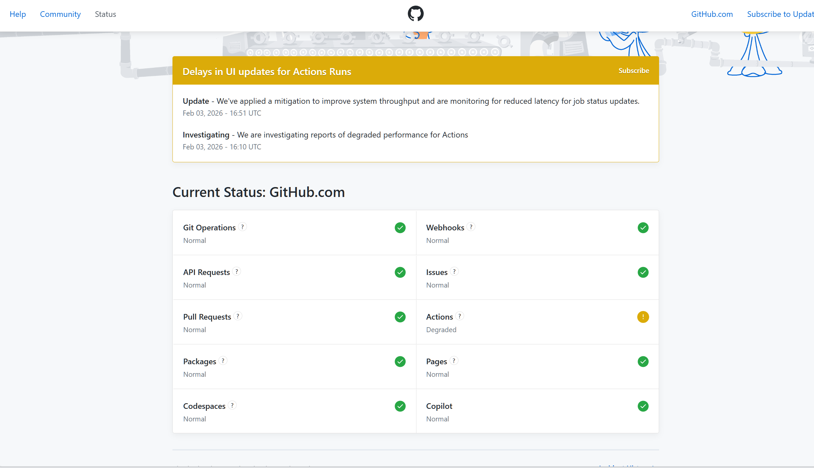

昨晚本来想看比赛的，结果一躺床上就睡着了，一口气睡了10个小时，把前几天的睡眠亏空补了回来。中午在福州吃了个pho，然后从福州赶回宁德。

晚上把房间整理了一下，洗了个澡，脏衣服洗了，随手网购了过年衣服。不然过年前快递要爆了，小地方运力有限，怕来不及拿到衣服。

不想学习，完整地放一天假。加上前两天，2月前三天都没怎么学。明天开始学习，争取做完：

Fine-tuning Qwen-1.5B with LoRA for Chinese Sentiment Analysis

lc：230

太抽象了，提交到github后，不自动触发action执行构建工作，我排查了老半天，是不是.github\workflows\deploy.yaml不小心被改了，半小时后福至心灵，突然感觉会不会是github的问题，结果打开了https://www.githubstatus.com/看到了这个

那还说啥了，重新提交一次，睡之，晚安。